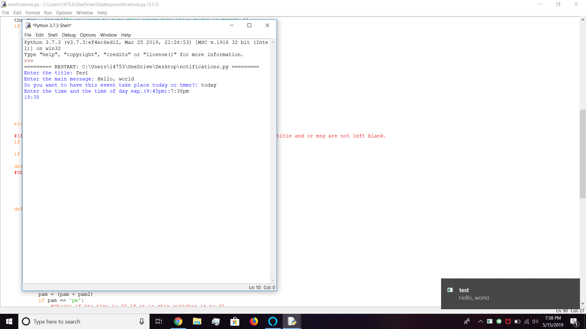

**NOTE:

THIS WILL OLNY WORK FOR WINDOWS

OTHER:

This code is really helpful and hopeful you think the same!

USAGE: 

This is what you will encounter when running this code

Enter the title: (Title) Hi

Enter the main message: (Body) Hello this is the code

Do you want to have this event take place today or tmmr?: (you can choose today or tmmr) today

Enter the time and the time of day exp.(09:45pm): (The time you want this code to be activated by) 3:45pm

15:45 (The time the code will be activited, and yes it switches to military time)

Requirements: 

Up to date:

1. win32api
2. win32gui
3. sys
4. os
5. struct
6. time
7. schedule

If something is not up to date or not installed:

python -m pip install (whatever)

Not working:

Make sure there are no spaced in between the time and the am or pm

Make sure you spelled tmmr or tomorrow correct

The content in the main msg and the title will not matter

If all else fails and something is not working please leave it in the issue's tab and I will be sure to keep you updated as soon as possible!

Credit: 

Some:
An unknown person on GitHub

Most:
Raj(ME)

This code will actively me maintained until further notice.

Made in Python 3.7.3
